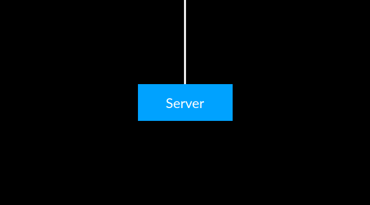
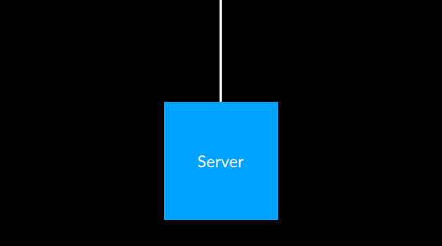
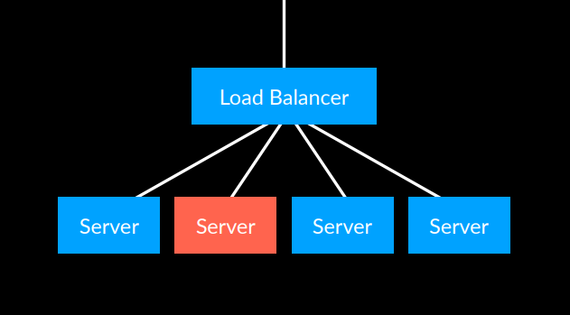

# Lecture 10 - Scalability
After a web application has been developed, there are still issues that need to be considered when deploying to the internet. A big concern is scalability. An application can work well with only a few users, but it also needs to be able to support many more people accessing data and using the application simultaneously. The vast majority of the time, there is no one best way to scale, but rather a number ways with different trade-offs that should be taken into account.

## Server Scaling

A server can only perform a finite number of tasks per second, measured in **hertz**. Modern servers and processors often have speeds in gigahertz. The operations being measured are low-level: adding two numbers together, for example. Due to limited server speed, a server can only respond to a limited number of users in a given second.

Determining the how much a server can handle is a process called **benchmarking**. It is not a good idea to figure out a server’s capacity by waiting for it to hit capacity.

### Vertical Scaling
One response to limited server capacity is **vertical scaling** - give the server more resources (memory, computing power) so it can handle additional load. Vertical scaling has its limits, however. A server can only be built up so much.

### Horizontal Scaling
Another approach is **horizontal scaling** - add more servers to handle additional load.

#### Load Balancing
With horizontal scaling, when a user tries to connect to the application, another piece of hardware, a **load balancer**, determines which server to send the user to. The load balancer can decide where to send a user based on a variety of different algorithms:
- **Random Choice**: Every time a user connects, a random server is chosen.
- **Round Robin**: The first connection is directed to server 1, the second to server 2, and so on, in a circular fashion.
- **Fewest Connections**: Whichever server is currently serving the fewest users will receive any new users.

Random choice and round robin might end up loading certain servers more heavily, and fewest connections might not always be a perfect measure of actual computational load. Putting a lot of effort into load balancing, however, creates an entirely new problem of creating another chokepoint that could get bogged down by a large number of users.

#### Session-Aware Load Balancing
A general problem with the load balancing model is that when a user is accessing multiple different pages repeatedly and making multiple requests, the load balancer might end up sending the user to a different server. The different servers a user has been directed to might not have the user’s session synchronized, for example. Therefore, there has to be some sort of **session-aware load balancing**.

- **Sticky Session**: After the initial connection, send the user to the same server repeatedly.
- **Sessions in Database**: Store all session information in a universally accessible database. This does result in more communication time, however.
- **Client-Side Sessions**: Store session information client-side, through a *cookie* for example, which is a collection of user-related session info which is sent with all requests. This might result in security issues, since cookies could be fabricated, etc.

### Autoscaling
The amount of traffic that a web application receives is often varied, which makes it difficult to set a fixed, permanent number of servers that should be used. Underestimating traffic could result in servers being overloaded, whearas overestimating could result in wasted resources. **Autoscaling** is a tool offered by many cloud-computing servers which scales resources based on how much traffic is coming in. Often, a minimum and maximum number of servers can be set, and then a load balancer will take care of the rest.

Autoscaling and other features are one of hthe benefits of **cloud computing** which allows web applications to be hosted on remote servers, as opposed to having to set up a server in the actual office of the company who owns the application, for example. Other benefits of cloud computing include not having to worry about IT services, etc. to actually maintain the server.

If one server goes offline, session data could be lost (depending on implementation), or a user could be continually redirected to an offline server. In order for a load balancer to be aware of the state of the servers, the servers should send a ‘heartbeat’ back to the balancer at a known interval. Faster heartbeats allow for a more current idea of server status, but slower heartbeats allowed for save energy and resources.

#### Cookies & Server Scaling
A simple way to ensure that a user is sent to the same server repeatedly is to give the user a cookie to send b ack which simply tells the load balancer what server the user came from.

Cookies can also store session information directly. Flask, for example, uses **signed cookies** which stores all the users session information. These sessions can be something a simple as a dictionary that contains a user ID and any other pertinent info.

One issue with cookies is increasing size as data becomes more complex. In terms of security, cookies can be stolen to gain access to a user’s account. Even without access to a cookie, storing explicitly formatted data (integers for user ids) is easily modified and faked. By including a private key in a web application, cookies can be generated with a signature based on the data and the private key. This signature should be difficult enough to generate that it can be received with reasonable confidence that it’s genuine.