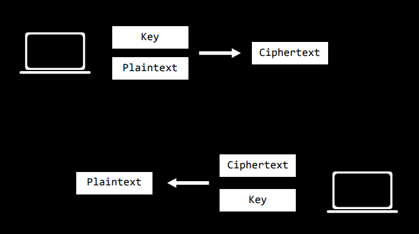

# Lecture 11 - Security

# TL-DR
- [OSS](#open-source-software) - Make sure which codebase you expose to the public / keep open source, and which you don't.
- [Services](#services-git-github-travis-etc) - Make sure to properly secure any services (by using long passwords, two-factor authentication, etc.) that have access to your source code (GitHub, Travis, AWS, Heroku, etc.) or other sensitive information that can be used to expose your source code or project information.
- [Services](#services-git-github-travis-etc) - Make sure to not push into Git or other Version Control systems sensitive information like passwords or private keys
- [HTML](#html) - Make sure to inform your users about phising attacks, possibility that someone might copy your front-end on a different, similar sounding domain name and redirect your users to a fake website, etc.
- [Crypto](#cryptography) - Make sure your app is using secure http/https protocols.
- [Env. Var.](#environmental-variables) - Make sure you are storing your sensitive keys, passwords, database credentials, etc. in environmental variables on the server.
- [Hashing](#hashing-passwords) - Make sure to Hash the passwords (aka. never store them in plaintext).
    * [Hashing + Salting](#salting--hashing-passwords) - Additionally, make sure to Salt the passwords before Hashing them, to prevent identical Hash formation from identical passwords that allow for various dictionary attacks.
- [Database Leak](#database-leakage) - Make sure your application does not leak unecessary data that might reveal and identify something.
- [SQL Injection](#sql-injection) - Make sure your application is not vulnerable to SQL injections. Use modern libraries to take care of input sanitization and communication with the database (like SQLAlchemy).
- [API's](#apis) - Make sure only right users can access your API. If you want to restrict certain users make sure to provide and ask for API keys.
- [API's](#apis) - Make sure only the right users have access to certain routes and therefore information
- [API's](#apis) - Make sure to rate limit users to prevent spam requests
- [XSS](#cross-site-scripting) - Make sure your application is not vulnerable to Cross-Site Scripting. Use modern libraries to take care of input sanitization to prevent injection of scripts in your HTML.
- [XSRF](#cross-site-request-forgery) - Make sure you use POST request whenever you are creating or updating a resource instead of GET request.
- [XSRF](#cross-site-request-forgery) - Make sure to include CSRF token with any form submission. Many modern libraries usually have this functionality built into them.
- [Scalability](#scalability) - Make sure to have filtering system in place to prevent DDoS attacks and blacklist suspicious users.


## Open Source Software
Open-source software’s code is openly available to anyone who would like to see it or develop and contribute to it. In terms of security, open-source software could be considered more secure because it can be seen by anyone. On the other hand, any security vulnerabilites can be exploited by anyone who can find them.


## Services (Git, GitHub, Travis, etc.)
With GitHub in particular, repositorires can be made private and restricted to certain users, but if someone gains access to a GitHub account, those repositories are still easily accessed.

Sites could try to prevent simple account hacking by limiting log-in attempts to a given frequency, by implementing a more rigorous user system that employs two-factor authentication, for example. **Two-factor authentication** requires access to a phyiscal device, such as a phone, to verify user identity.

With Git or other version control systems in general, it is important that **sensitive information leaks**, like a password or information, doesn’t get pushed to a repository. If such a situation were to occur, even pushing another commit removing those credentials wouldn’t be secure. Due to the nature of version control, all old commits are still visible.

It is possible to revert to an old commit and prune away extra commits and force push this back to GitHub, but all that code should be considered compromised. Any compromised credentials should be exchanged with new ones.

Also when using a CI tool such as Travis, that tool has access to the entire codebase. Now, if either Travis or GitHub, for example, are compromised, so is the codebase. This is the case whenever accounts or sites grant other applications access to user information. When designing services that share information, it is important to be careful when choosing whom to share with. Users of these services should be careful about what information is potentially being exposed.


## HTML
Because any page’s HTML source code can be easily viewed and copied, a bank’s website’s HTML could be replicated to deceive users into inputting their credentials.

Links in particular are easily abused. Any links can be modified to redirect users to a different web page entirely to trick a user into doing something. The inner text of a link, which is displayed to a user, can be changed to be completely different from what the actual link is.

From the user’s end, one way to defend against these security vulnerabilites is to be careful about what links are being clicked. Web browsers often display in a status bar or some other UI the actual link.

Ultimately, there’s no way to avoid a site’s HTML from being viewed or copied because the server has to send to HTML source code to a user in order for the web page to be rendered by the browser.


## Servers (like Flask, Django, etc.)
With any web server, packets of information are being sent between routers, which opens up new security concerns. Often times, a single request sent to a server will travel through multiple routers. Any of those midway points could potentially read any of the information being passed.


### Cryptography
Cryptography is the process of encrypting traffic flowing through these routers so that a middleman cannot read the data.

**Secret-key cryptography** consists of both the sender and the recipient both know a secret key which can be used, along with a cryptographic algorithm, to encode and decode the message. The encrypted version is called **ciphertext**. The unencrypted version is **plaintext**.

In order for this system to work, only the sender and the recipient can know the key, which means that the key cannot be transmitted along with ciphertext.



**Public-key cryptography** uses two keys, a **public key** and a **private key**. The public key can only be used to encrypt information, while the private key, which should never be shared or sent across a network, can be used to decrypt information.

Every time a message needs to be sent, the recipient sends their public key, which can be known, to the sender, who uses the key to encrypt the message. The recipient’s private key is the only key which can be used to decrypt the ciphertext. It doesn’t matter, then, that intermediaries might have the public key.


### Environmental variables
As has been noted, passwords and other credentials should never be put in source code. What should be done instead is to set parameters like secret keys using environment variables, which are located inside the system the program is running on but not in the program’s code itself.

```
app.config["SECRET_KEY"] = "dHdlbnR5ZWlnaHQ                 # Bad practice
app.config["SECRET_KEY"] = os.environ.get("SECRET_KEY")     # Good practice
```


## SQL

### Hashing Passwords
When storing user information, such as username and passwords, in a database, sensitive information like passwords should be encrypted. Specifically, the **hashed** version, which is the output of a hash function which deterministically generates a sequence based on the input, which is the plaintext password.

Hashed functions are generally designed to be one-way, such that it is unfeasible to decrypt a hashed password. To log a user in, the entered password simply needs be run through the (deterministic) hash function and compared with the stored hash. If a hash function is known, malicious users who have gained access to a database could still run common passwords through the function to compare to the hashes in the table.

Additionally, hashed passwords are not unique to themselves due to the deterministic nature of hash function: when given the same input, the same output is always produced. If Alice and Bob both choose `dontpwnme4` as a password, their hash would be the same: `4420d1918bbcf7686defdf9560bb5087d20076de5f77b7cb4c3b40bf46ec428b`

The attacker can better predict the password that legitimate maps to that hash. Once the password is known, the same password can be used to access all the accounts that use that hash.

### Salting & Hashing Passwords
To mitigate this we salt the passwords. According to OWASP Guideliness, a **salt** is a fixed-length cryptographically-strong random value that is added to the input of hash functions to create unique hashes for every input, regardless of the input not being unique. A salt makes a hash function look non-deterministic, which is good as we don't want to reveal password duplications through our hashing.

Let’s say that we have password `farm1990M0O` and the salt `f1nd1ngn3m0`. We can salt that password by either appending or prepending the salt to it. For example: `farm1990M0Of1nd1ngn3m0` or `f1nd1ngn3m0farm1990M0O` are valid salted passwords. Once the salt is added, we can then hash it.

Alice and Bob decide to use both the same password, `farm1990M0O`. For Alice, we'll use `f1nd1ngn3m0` again as the salt. However, for Bob, we'll use `f1nd1ngd0ry` as the salt:

```
User: Alice
Password: farm1990M0O
Salt: f1nd1ngn3m0
Salted input: farm1990M0Of1nd1ngn3m0
Hash (SHA-256): 07dbb6e6832da0841dd79701200e4b179f1a94a7b3dd26f612817f3c03117434

User: Bob
Password: farm1990M0O
Salt: f1nd1ngd0ry
Salted input: farm1990M0Of1nd1ngd0ry
Hash (SHA-256): 11c150eb6c1b776f390be60a0a5933a2a2f8c0a0ce766ed92fea5bfd9313c8f6
```

Different users, same password. Different salts, different hashes. If someone looked at the full list of password hashes, no one would be able to tell that Alice and Bob both use the same password.

### Database Leakage
**Database leakage** refers to any information that is unintentionally released from a database. One example might be a password reset page, where a user can enter the e-mail to get a link to reset a password. If the site has one message for a sent e-mail and another message for an e-mail that’s not tied to an account, then users can figure out if an e-mail is associated with an account. This information, even if it doesn’t compromise the account, might still be sensitive.


### SQL Injection
SQL injection consists of sending, through a form or otherwise, SQL code to web server which then executes that code a database. This is a potential vulnerability if user input is being passed directly into a command like so:

```py
username = request.form.get("username")
password = request.form.get("password")
user = db.execute("SELECT * FROM users WHERE (username = '" + username + "') AND (password = '" + password + "')").first()
```


To avoid this, any input that is passed, in one way or another, into a command should be have potentially dangerous characters, like `'`, escaped. Often times, this **input sanitation** is done automatically when using libraries such as SQLAlchemy.


## API's
When designing APIs, it is often important to ensure that certain users only have access to certain information. To keep track of users, API keys, simply long strings, are generated and associated with every user. Every time an API request is made, an API key must be passed with it.

API keys allow for **route authentication**, or verifying that a user has permission to access a certain route. They also can be used for **rate limiting**, or ensuring that a user can only make so many requests.


## JavaScript
While HTML and CSS can be abused, they only affect how the browser renders a web page. With JavaScript arises the possibility for malicious code to be run inside the browser.


### Cross-Site Scripting
Similar to how SQL injections abused the possibilities for users to modify the code being run on a database, cross-site scripting consists of running some arbitrary JavaScript code inside a browser. Here’s is an example of a Flask application that is vulnerable to such an attack:

```py
from flask import Flask, request

app = Flask(__name__)

@app.route("/")
def index():
    return "Hello, world!"

@app.errorhandler(404)
def page_not_found(e)
    return "Not Found: " + request.path
```

`page_not_found` will be run whenever the server returns a `404 Not Found` response code, thanks to Flask’s built in error handler.

`request.path` is the URL which the user tried to access, but was not found by the server.

If, instead an incorrect path, the user entered some JavaScript code in the URL (for example, `/<script>alert('hi')</script>`), then that code will be rendered in the HTML and run.

Lots of modern browsers such as Chrome have *cross-site scripting auditors* built-in that will detect relatively simple cases, such as the previous example, and will not render the page. Nonetheless, there are cases which will get past such auditors, and not all browsers will have such features.

More dangerous instancs of cross-site scripting can compromise passwords, credit card information, etc. Take the following script, for example:

```js
/<script>document.write('")</script>
```

`document.write` adds new content to the HTML source.

The added content is an image, with a URL to some unknown site, but it is also being passed as a cookie `document.cookie`, which represents the cookie for the current page. If a hacker is monitoring the traffic to web server, then this request, which contains the cookie being used for the current site, is compromised. The hacker can then use that cookie to log in as that user on the current site. These are the sorts of vulnerabilites that cross-site scripting auditors try to protect against.

One defense against cross-site scripting, like SQL injection is to ensure that any potentially dangerous characters are escaped. Frameworks like Flask and Django can often be configured to do this automatically.

Cross-site scripting does not require JavaScript to passed through the URL. Here’s an example that abuses a database:

```py
@app.route("/", methods=["GET", "POST"])
def index():
    if request.method == "POST":
        contents = request.form.get("contents")
        db.execute("INSERT INTO messages (contents) VALUES (:contents)", {"contents": contents})
    messages = db.execute("SELECT * FROM messages").fetchall()
    return render_template("index.html", messages=messages)
```

This is a simple notes/message board app in which users can type in messages to be stored in a databse. Anytime the page is refreshed, all old messages are loaded.

Now, insteading of tricking the user to make a request with malicious JavaScript in the URL, all that needs to be done is to enter that code as a message. The first time the message is submitted, it is being sent through to the server, which means that it is likely that a cross-site scripting auditor will catch it. After that, however, there is nothing suspicious about the URL. The code is being loaded server-side from the database, which means an auditor won’t be able to detect it, making this vulnerability arguably more severe.

Other examples of malicious uses for cross-site scripting include rendering a completely different page with `document.body.innerHTML = "insert contents here"`, redirecting to different site with `window.location = "hacker_URL"`, etc.

Note that for the previous example, the HTML had to purposefully written in order to get around Flask’s built-in character escaping behavior:

```html
<ul>
    
        <li>{{ message.contents | safe }}</li>
    
</ul>
```

`message.contents | safe` indicates that nothing should be escaped. Note that whenever template contents are generated manually, such as via string concatentation in the first example, that these sorts of automatic defenses are bypassed as well.


### Cross-Site Request Forgery
Cross-site request forgery (CSRF) consists of forging a request to different website that the user is already logged in to. Consider a bank’s website, which allows for money transfers at `/transfer` by passing in the recipient and an amount. Here’s some HTML that can exploit that:

```html
<body>
    <a href="http://yourbank.com/transfer?to=brian&amt=2800"?>
        Click Here!
    </a>
</body>
```

If the user is already logged in to the bank, then simply following that link will initiate the transfer. The bank could defend against this sort of intrusion by not using a `GET` request for this sort of functionality. In general, it is good practice to use `POST` requests and form submissions, rather than `GET` requests, for any such state modifications.

A more insidious version of the previous exploit uses the same trick of putting the link inside an `img` element, such that the user doesn’t even need to do anything other than load the page to trigger the transfer.

```html
<body>
    
</body>
```

Even if the bank was wise enough to require a `POST` request to initiate a transfer, there is still the potential for abuse.

```html
<body>
    <form action="https://yourbank.com/transfer" method="post">
        <input type="hidden" name="to" value="brian">
        <input type="hidden" name="amt" value="2800">
        <input type="submit" value="Click Here!">
    </form>
<body>
```

These inputs, pre-filled with the desired values, will not be shown to the user because of the `type="hidden"` attribute. All the user sees is a button.

By changing the first `body` tag of the previous example, the form can be made to submit automatically, without the user having to do anything at all.

```html
<body onload="document.forms[0].submit()">
```

`document.forms[0]` returns the first form in the document, which is already pre-filled with the bank transfer information. As soon as the page is loaded, the `POST` request will be made.

The solution to this vulnerability is to add a special **token**, essentially a password, to be submitted with every form. These tokens are added automatically by the server, and when the server sees a request, it can compare the token it receives with the token it knows to have inserted. In this way, only valid form requests will be respected. Because a new token is generated with every form, they cannot be reused or stolen.

Django and many other web frameworks have support for this CSRF token functionality. With Django, adding a CSRF token is simple:

```py
<form action="https://yourbank.com/transfer" method="post">
    
    
    
    <input type="hidden" name="to" value="brian">
    <input type="hidden" name="amt" value="2800">
    <input type="submit" value="Click Here!">
</form>
```


## Scalability
Because any server is a finite machine capable of handling a finite number of requests, a hacker can send an excessive number of requests in a short period of time to try and shut down a server. This is called a **denial of service**, or **DoS**, attack.

A **distributed denial of service**, or **DDoS**, attack consists of using a large number of bots or computers to make an even greater number of requests to a single server.

One potential safeguard against DDoS attacks is a filtering system to try and ensure that only valid requests are respected. If a user is suspicious, they could be blacklisted to prevent them from making any future requests. In the end, however, it often does come down to a battle of resources between the attacker and the server(s). Often times, this needs to be dealt with at the server or ISP level, as opposed to at the application level, especially when working with a large web application.